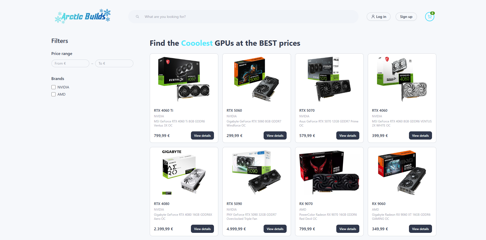
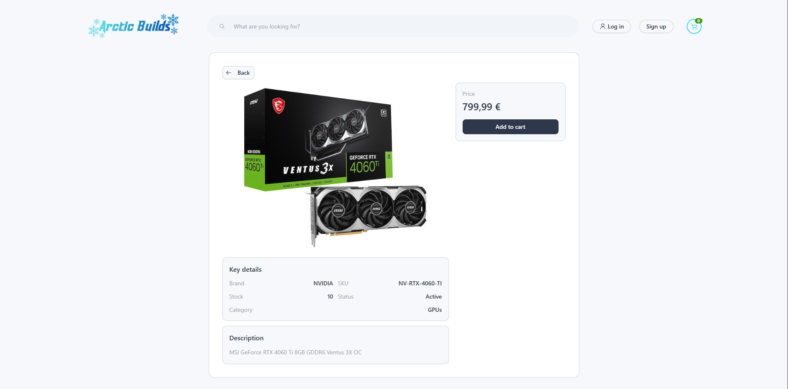
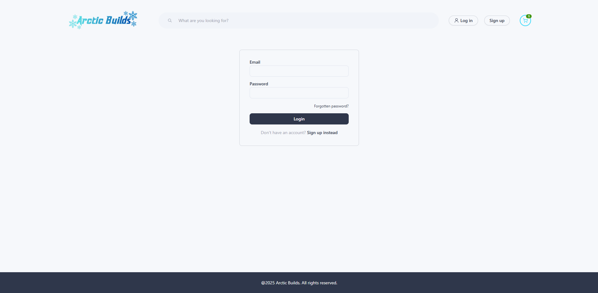
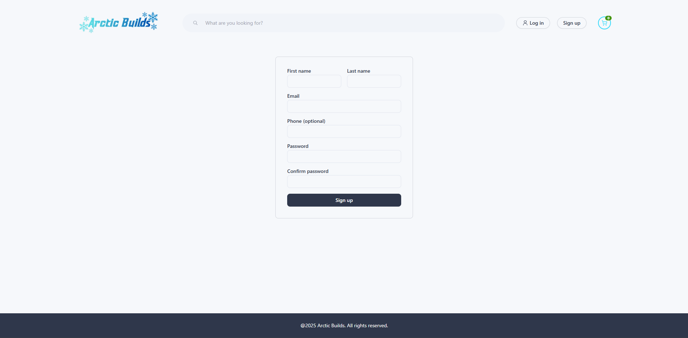
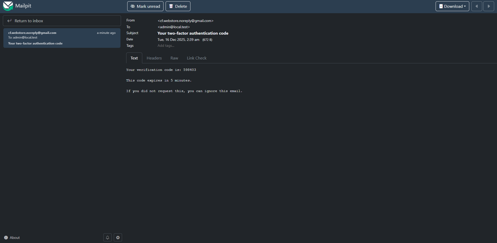
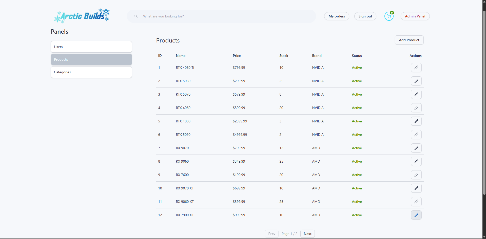
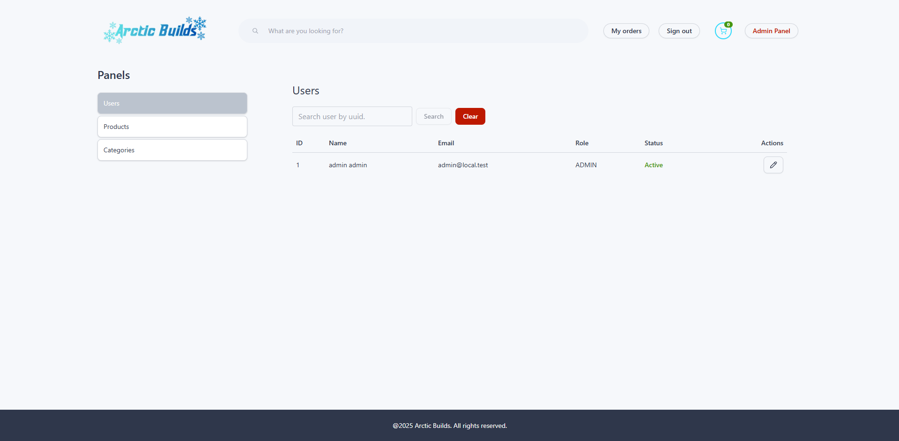
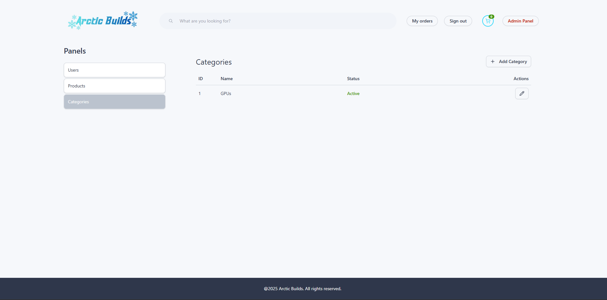

# Arctic Builds: Full-Stack E-Commerce Demo Web Application

The app simulates an e-commerce flow for PC hardware (GPUs catalog): browse products, filter, add to cart, and place a **demo** order with **payment**.

---

## Table of Contents
- [Features](#features)
- [Tech Stack](#tech-stack)
- [Security](#security)
- [How to Run (Docker)](#how-to-run-docker)
- [Default URLs](#default-urls)
- [Deafult Admin User credentials](#default-admin-user-credentials)
- [Email delivery](#email-delivery)
- [Project Rules / Decisions](#project-rules--decisions)

---

## Features

### Customer
- Product catalog browsing
- Filtering (brand + price range) and pagination
- Product details pages
- Cart:
    - update quantities
    - clear cart
    - totals + tax calculation
- Checkout:
    - shipping address form
    - demo payment
    - place order
- Order confirmation via email (order code)
- “My orders” page using the emailed order code
- Account flows:
    - sign up
    - email verification
    - login + **2FA**

### Admin
- Admin panel (protected):
    - Users list + user search (UUID-based)
    - Create/Edit Categories
    - Create/Edit Products
- Soft management:
    - Products/Categories are **not deleted**
    - They are marked **inactive** and won’t render in the shop

---

## Tech Stack

### Backend
- Java **21**
- Spring Boot **3.5.7**
- MySQL **8.0**
- Redis (for 2FA/email/order flows)

### Frontend
- React **19.2**
- Vite **7.2.4**
- JavaScript
- Tailwind CSS
- React Router **7.10**

### Infrastructure
- Docker Compose
- NGINX 
- Mailpit (local email inbox)
- Swagger UI

---

## Security
- JWT authentication
- JWT stored in **localStorage**
- Redis-backed flows:
    - **2FA** (email-delivered code, time-limited)
    - **email verification**
    - **order code email**

---

## How to Run (Docker)

### Prerequisites
- Docker installed

### 1) Create environment file
From repository root:
1. Copy the example env:
    - `./.env.docker.example`
2. Create:
    - `./.env.docker`
    - (cp .env.docker.example .env.docker)

### 2) Build and start
From repository root:
```bash
docker compose --env-file .env.docker up -d --build
```

#### If something breaks (common reset commands)
```bash
docker compose --env-file .env.docker down -v
docker compose --env-file .env.docker up -d --build --force-recreate
```

#### Recreate only one service:
```bash
docker compose --env-file .env.docker up -d --build --force-recreate frontend
docker compose --env-file .env.docker up -d --build --force-recreate backend
```
---
## Default URLs

- Backend: http://localhost:8080

- Frontend: http://localhost:5173/

- Swagger UI: http://localhost:8080/swagger-ui.html

- MySQL: localhost:3307-3306

- Redis: localhost:6379

- Mailpit: http://localhost:8025

---
## Default Admin user credentials

- Email: admin@local.test

- Password: Admin1234!?.

---
## Email delivery (Mailpit vs Gmail SMTP)

This project supports **two email modes**:

### 1) Local development (recommended): Mailpit
By default (Docker setup), emails are sent to **Mailpit**:
- Inbox UI: `http://localhost:8025`

This avoids real SMTP configuration and works out-of-the-box for reviewers.

### 2) Real SMTP (without docker): Gmail SMTP
The backend also supports sending real emails via **Gmail SMTP**.

**Important warnings**
- Do **NOT** commit real SMTP credentials.
- Gmail typically requires an **App Password**.

To enable Gmail SMTP, set the SMTP variables in your environment file (example only):
```env
MAIL_HOST=smtp.gmail.com
MAIL_PORT=587
MAIL_USERNAME=your_email@gmail.com
MAIL_PASSWORD=your_gmail_app_password
```
---
## Screenshots

### Home Page



### Login/Signup




### Cart + Checkout


### Admin Panel





